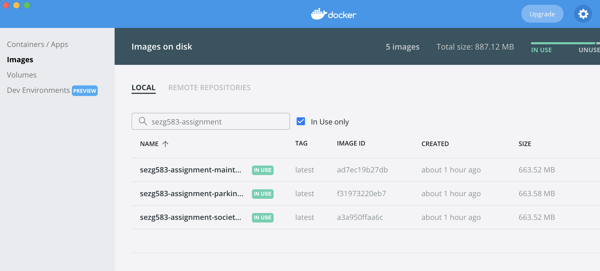
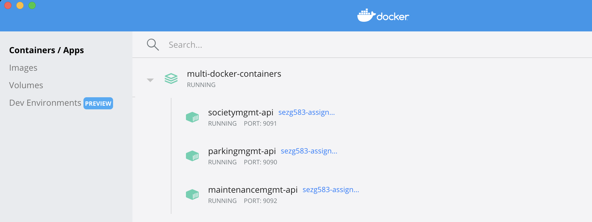
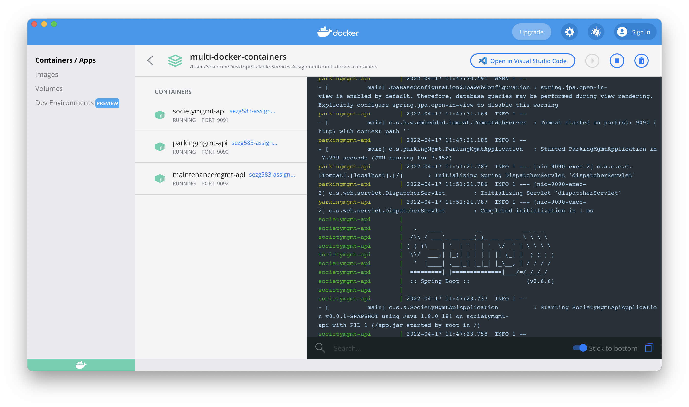

# SEZG583 Scalable Services Assignment 1

## Running multiple microservices each in individual docker containers

This project contains scripts that are used to build the artifacts for the 3 microservices developed as part of Assignment 1 and create a single docker image for each microservice. These images will then be run in the separate containers.

This is done using the help of `docker-compose`. A `docker-compose.yml` file is written to help create the multi-container setup by declaring each image to be run in a separate container as a `service`, and exposing the required services to each other using the `hostname` property. This `hostname` is essential for other containers within the docker-compose network to locate each other.

We also utilise other properties like `environment` to setup expected environment variables, `ports` to indicate to the network the host:container port mapping and `depends_on` to ensure that each service that depends on another service is built only after all the services it depends on are setup and running.

### Container Images


### Multi-container network running in Docker Desktop


### Container Logs


To deploy the services in individual containers, the following commands are used:
- To build the artifacts (you need to have Java 8)
	```bash
	./clone-repo-step.sh
	./build-jars-step.sh
	```
- To build the docker images (run from root of each multi-docker-containers repo, you need to have docker/docker desktop installed)
	```bash
	./create-docker-images
	```
- To create the docker containers and run them using docker-compose (you need to have docker/docker desktop installed)
	```bash
	docker-compose up
	```
- To bring down the containers used as part of the docker-compose
	```bash
	docker-compose down
	```

Below are few other helper docker commands used:
- To view the built docker images
	```bash
	docker image ls
	```
- To delete a docker image
	```bash
	docker image rm sezg583-assignment-single-container
	```
- To view running docker containers
	```bash
	docker ps
	```
- To stop a docker container
	```bash
	docker stop <container_id>
	```
- To stop a docker container
	```bash
	docker stop <container_id>
	```
- To remove a docker container
	```bash
	docker rm <container_id>
	```