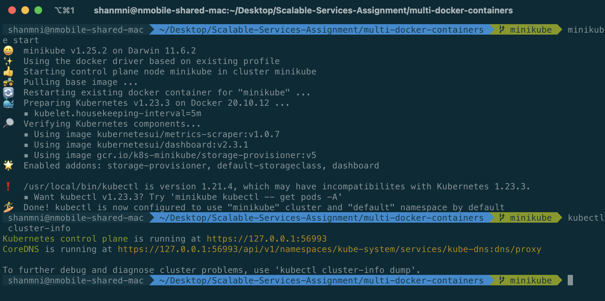
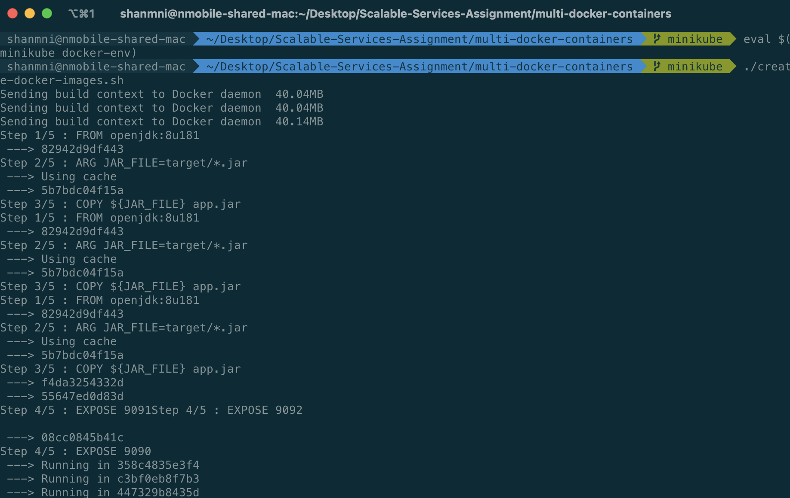
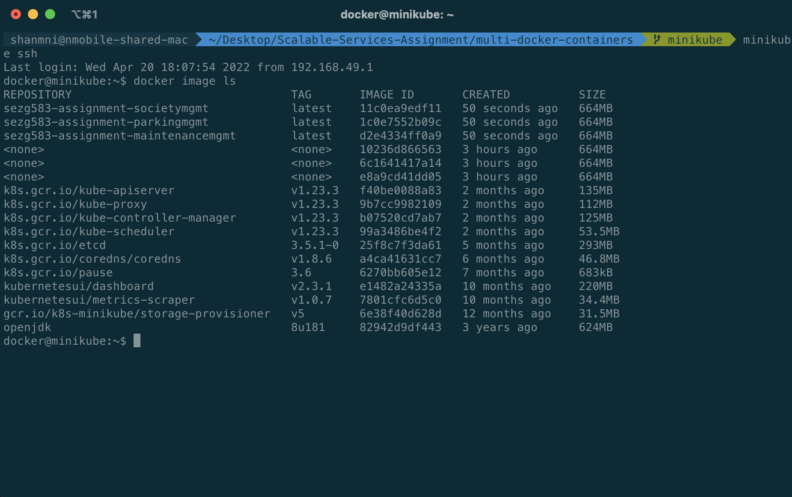
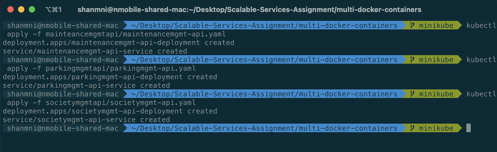
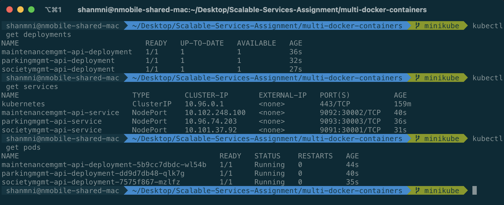

# SEZG583 Scalable Services Assignment 1

## Running multiple microservices each in individual docker containers

This project contains scripts that are used to build the artifacts for the 3 microservices developed as part of Assignment 1 and create a single docker image for each microservice. These images will then be run in the separate containers.

This is done using the help of `docker-compose`. A `docker-compose.yml` file is written to help create the multi-container setup by declaring each image to be run in a separate container as a `service`, and exposing the required services to each other using the `hostname` property. This `hostname` is essential for other containers within the docker-compose network to locate each other.

We also utilise other properties like `environment` to setup expected environment variables, `ports` to indicate to the network the host:container port mapping and `depends_on` to ensure that each service that depends on another service is built only after all the services it depends on are setup and running.

### Container Images


### Multi-container network running in Docker Desktop


### Container Logs


To deploy the services in individual containers, the following commands are used:
- To build the artifacts (you need to have Java 8)
	```bash
	./clone-repo-step.sh
	./build-jars-step.sh
	```
- To build the docker images (run from root of each multi-docker-containers repo, you need to have docker/docker desktop installed)
	```bash
	./create-docker-images.sh
	```
- To create the docker containers and run them using docker-compose (you need to have docker/docker desktop installed)
	```bash
	docker-compose up
	```
- To bring down the containers used as part of the docker-compose
	```bash
	docker-compose down
	```

Below are few other helper docker commands used:
- To view the built docker images
	```bash
	docker image ls
	```
- To delete a docker image
	```bash
	docker image rm sezg583-assignment-single-container
	```
- To view running docker containers
	```bash
	docker ps
	```
- To stop a docker container
	```bash
	docker stop <container_id>
	```
- To stop a docker container
	```bash
	docker stop <container_id>
	```
- To remove a docker container
	```bash
	docker rm <container_id>
	```

## Minikube deployment
To deploy the services in individual pods, the following commands are used:
- To build the artifacts (you need to have Java 8)
	```bash
	./clone-repo-step.sh
	./build-jars-step.sh
	```
The rest of the commands assume you have minikube installed, and docker engine is running:
- Start the minikube cluster and check if the cluster is up
  ```bash
	minikube start
	kubectl cluster-info
	```
	
- Since our images are not uploaded to any online registry, we have inform minikube to use only the local images. For this, we need to build the images from local within minikube. To do this, run the following commands:
	```bash
	eval $(minikube docker-env)
	./create-docker-images.sh
	```
	
- Verify the images are available in docker inside minikube
	```bash
	minikube ssh
	docker image ls
	exit
	```
	
- To create the required resources in kubernetes, we use the deployment and service description files within each microservice code repository. To apply these configuration files to create the resources, we can use the apply command (run from root of the project):
  ```bash
	# kubectl apply -f <file_name>
	kubectl apply -f mainteancemgmtapi/maintenancemgmt-api.yaml
	kubectl apply -f parkingmgmtapi/parkingmgmt-api.yaml
	kubectl apply -f societymgmtapi/societymgmt-api.yaml
	```
	
- Verify that the configured deployments, services and pods are up and running:
  ```bash
	kubectl get deployments
	kubectl get services
	kubectl get pods
	```
	
- The deployment is now complete. To test locally, port-forward the required ports to the minikube cluster. At this point, you can make API calls to the REST endpoint as usual.
  ```bash
	# kubectl port-forward <resource_name> <local_port>:<exposed_pod_port>
	kubectl port-forward service/societymgmt-api-service 9091:9091
	kubectl port-forward service/maintenancemgmt-api-service 9092:9092
	kubectl port-forward service/parkingmgmt-api-service 9093:9093
	```